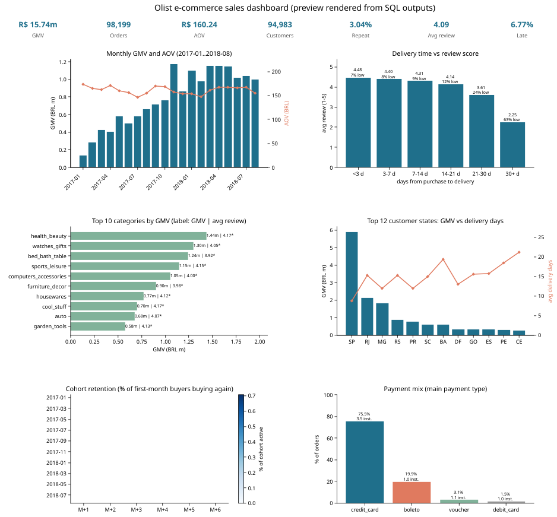
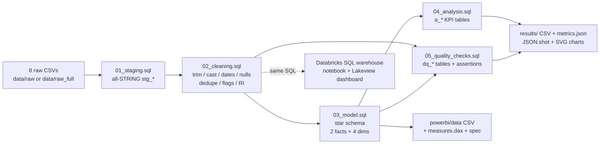

# da-learn-01 - E-commerce sales analysis (SQL cleaning -> star schema -> KPIs -> dashboards)

**Data Analyst learning series, project 01.** An end-to-end analyst workflow on the real, multi-table
**Olist Brazilian E-Commerce** dataset (~100k orders, 8 related tables): SQL data cleaning, a star-schema model,
business KPI analysis, data-quality evidence, and dashboard packages for **Databricks** and **Power BI**.

* SQL is written in the **Databricks / Spark SQL dialect** and executed locally on **DuckDB** (a 4-macro shim file covers the differences).
* All results come from the **full dataset** run. Git contains a reproducible 22-order subset of the raw data (see [Dataset](#dataset)).
* **Databricks: executed for real** on a serverless SQL warehouse (Unity Catalog), with a published Lakeview dashboard; all 21 table row counts match DuckDB. Power BI: **kit** (a `.pbix` cannot be built on Linux).



## Business questions
1. How big is the business and how is it trending? (GMV, orders, AOV, MoM growth)
2. Does delivery time drive customer satisfaction? (delivery days / lateness vs review score)
3. Which product categories and which regions perform best / worst?
4. Do customers come back? (monthly cohorts, retention, repeat rate)
5. How concentrated is the seller base, and how do customers pay?
6. How clean is the data, and what had to be fixed?

## Pipeline


## Key insights (full data, BRL)
| # | Insight |
|---|---|
| 1 | **R$ 15.74m GMV** from **98,199** revenue orders, **AOV R$ 160.24**, 94,983 customers. Jan-Aug 2018 GMV is **+140.4 %** vs Jan-Aug 2017; Black Friday Nov-2017 was the peak month (+53.3 % MoM). |
| 2 | **Late deliveries kill ratings:** late orders score **2.27** vs **4.29** on time; 62.4 % of late orders get 1-2 stars. 30+ day deliveries average 2.25 stars vs 4.48 for < 3 days. |
| 3 | **Logistics gap by region:** Southeast (64.6 % of GMV, SP 37.4 %) delivers in 10.8 days on average, the North in 22.6 and the Northeast in 20.0; late rate SP 4.49 % vs AL 21.41 %. |
| 4 | **Top categories:** health_beauty R$ 1.44m, watches_gifts R$ 1.30m, bed_bath_table R$ 1.24m (most orders, 9,399, but lowest review of the top 5: 3.92). |
| 5 | **Retention is ~0:** only 3.04 % of customers order twice; avg month+1 cohort retention is 0.46 %. |
| 6 | **Concentration:** top 10 % of sellers = 66.6 % of GMV (top 1 % = 25.3 %); credit card = 75.5 % of orders at 3.55 installments on average. |

Full write-up with data-quality findings: [`results/RESULTS.md`](results/RESULTS.md).

## Dataset
| | |
|---|---|
| Name | Brazilian E-Commerce Public Dataset by Olist |
| Original (Kaggle) | https://www.kaggle.com/datasets/olistbr/brazilian-ecommerce |
| License | **CC BY-NC-SA 4.0** (non-commercial; attribution to Olist; share-alike) |
| Mirror used | https://github.com/0PeterAdel/Brazilian-ECommerce/tree/master/0.DataSet (no Kaggle API key available; row counts match Kaggle's; SHA-256 pinned in `scripts/download_full_data.py`) |
| Full size used | 8 CSVs, 63.4 MB: orders 99,441 - order_items 112,650 - payments 103,886 - reviews 99,224 - customers 99,441 - products 32,951 - sellers 3,095 - category translation 71 |
| Period | 2016-09-04 .. 2018-10-17 |
| In git | **Subset** in `data/raw/` (22 orders + all related rows, ~20 KB) built by `scripts/make_sample.py` with the deterministic rule `order_id < '001'`. The full data is downloaded by a script. `olist_geolocation_dataset.csv` is not used. Details: [`data/README.md`](data/README.md) |

Why a subset? The repo was published through a text-only GitHub API where committing 63 MB of CSV was not feasible; results were computed on the full data.

## Cleaning steps (sql/02_cleaning.sql) - full-data row counts
| Step | Raw -> clean |
|---|---|
| Trim + lowercase IDs / statuses / categories; accent-strip + lowercase cities (`translate`); upper-case states; re-pad zip prefixes to 5 chars | text standardised (source cities already normalised: 0 changes) |
| Type casting with `TRY_CAST` (timestamps, DECIMAL(12,2) money, INT scores) | all 7 tables |
| Dedupe with `ROW_NUMBER()` on natural keys | orders 99,441 -> 99,441; items 112,650 -> 112,650; payments 103,886 -> 103,886; **reviews 99,224 -> 98,673** (551 extra reviews/order) |
| Null handling | 610 missing categories -> `unknown`; 0 g weights -> NULL; 0 installments -> 1; `not_defined` payment -> `unknown`; review text replaced by `has_comment` + `comment_length` |
| Date logic & flags | delivery_days, promised_days, is_late, 166 bad-chronology orders, 8 delivered-without-date |
| Outlier flags | 4,074 items > Q3 + 3*IQR price, 1,117 top-1 % price, 4,124 freight > price (flagged, not dropped) |
| Referential integrity | orders->customers, items->orders/products/sellers, payments/reviews->orders: 0 orphans |
| Star schema (03) | fact_orders 99,441, fact_order_items 112,650, dim_customer 99,441, dim_product 32,951, dim_seller 3,095, dim_date 774 |
| Assertions (05) | 10 / 10 PASS |

## How to run
```bash
pip install -r requirements.txt
python run_pipeline.py --source sample        # 22-order subset in git, ~1 s -> data/clean, powerbi/data, results/sample
python scripts/download_full_data.py          # full 63 MB into data/raw_full (checksum-verified)
python run_pipeline.py --source full          # -> data/clean_full, results/ (tables, metrics.json, JSON.shot, charts)
python scripts/build_databricks.py            # regenerate the Databricks notebook from sql/ (--with-dashboard: also the dashboard JSON)
```
* **Databricks**: see [`databricks/SETUP.md`](databricks/SETUP.md) - upload CSVs to a UC volume, import `olist_pipeline_notebook.sql`, Run all, import `olist_sales_dashboard.lvdash.json`.
* **Power BI**: see [`powerbi/BUILD_GUIDE.md`](powerbi/BUILD_GUIDE.md) - load 6 CSVs, relationships from `model.md`, measures from `measures.dax`, pages from `dashboard_spec.md`.

## Databricks run (2026-10-01)
| Object | Workspace path |
|---|---|
| Raw CSVs (full, 63.4 MB) | `/Volumes/workspace/da_learn_01/raw/` |
| Tables | `workspace.da_learn_01` (stg_*, cln_*, dim_*, fact_*, a_*, dq_*) |
| Notebook | `/Workspace/Shared/da-learn-01-ecommerce-sales-analysis/olist_pipeline_notebook` |
| Dashboard (published) | "da-learn-01 Olist e-commerce sales" - `/Workspace/Shared/da-learn-01-ecommerce-sales-analysis/da-learn-01 Olist e-commerce sales.lvdash.json` |

| Table | DuckDB rows | Databricks rows |
|---|---|---|
| stg_reviews -> cln_reviews | 99,224 -> 98,673 | 99,224 -> 98,673 |
| fact_orders | 99,441 | 99,441 |
| fact_order_items | 112,650 | 112,650 |
| dim_customer / dim_product / dim_seller / dim_date | 99,441 / 32,951 / 3,095 / 774 | 99,441 / 32,951 / 3,095 / 774 |
| a_kpi_headline (GMV R$ 15,735,527.03, AOV R$ 160.24, ...) | identical | identical |
| dq_assertions | 10/10 PASS | 10/10 PASS |

All 21 tables match (full list in `databricks/run_outputs/duckdb_vs_databricks.json`). The one value difference is the top-1 % price flag
(1,134 Databricks vs 1,117 DuckDB) because `percentile_approx` is approximate on Spark.

## Repo layout
```
run_pipeline.py              # runs sql/00..05 on DuckDB, exports CSV/JSON, renders charts
requirements.txt
sql/
  00_duckdb_compat.sql       # DuckDB-only shims for Spark functions (skip on Databricks)
  01_staging.sql             # raw CSV -> all-STRING stg_* tables
  02_cleaning.sql            # cln_* tables (standardize, cast, nulls, dedupe, flags, RI)
  03_model.sql               # star schema: fact_orders, fact_order_items, dim_date/customer/product/seller
  04_analysis.sql            # a_* KPI tables (headline, monthly, delivery, category, state/region, payment, cohort, seller)
  05_quality_checks.sql      # dq_row_counts, dq_null_rates, dq_issues, dq_assertions
scripts/
  download_full_data.py      # full dataset from mirror + SHA-256 check
  make_sample.py             # deterministic subset -> data/raw
  make_charts.py, svgmin.py  # SVG dashboard + charts
  build_databricks.py        # generates the Databricks notebook (and, with --with-dashboard, the dashboard JSON) from sql/
data/
  raw/                       # 8 raw CSVs (subset, verbatim)
  clean/cleaned/             # cleaned entity tables (subset run)
  README.md                  # source, license, subset rule
databricks/                  # notebook + Lakeview dashboard (exported from the workspace), run_outputs/ (Databricks vs DuckDB), SETUP.md
powerbi/                     # data/ (6 star CSVs, subset run), measures.dax, model.md, dashboard_spec.md, BUILD_GUIDE.md
results/
  RESULTS.md  metrics.json  JSON.shot
  charts/*.svg               # dashboard.svg + 6 single charts
  tables/*.csv               # all a_* and dq_* outputs (full run)
  sample/JSON.shot           # subset run snapshot, for verification
```

## SQL dialect notes
The scripts 02-05 are Spark SQL. DuckDB runs them after `00_duckdb_compat.sql` defines `unix_timestamp`, 2-arg `datediff(end, start)`,
`percentile_approx` and Spark-style `dayofweek` (1 = Sunday). Staging differs (`read_csv` vs `read_files`).
`percentile_approx` is exact on DuckDB, approximate on Databricks (observed: top-1 % price flag 1,117 vs 1,134 rows). Details in `databricks/SETUP.md`.

## Limitations
* Olist anonymises customers per order (`customer_id`); repeat-buyer logic uses `customer_unique_id`.
* GMV uses price + freight; payments differ by > R$ 1 on 1,021 orders (installment interest / vouchers).
* `is_late` compares calendar dates (delivered date > estimated date).
* 2016 and Sep/Oct 2018 are sparse in the source, so trend charts use 2017-01 .. 2018-08.

Data (c) Olist, CC BY-NC-SA 4.0. Code: MIT.
