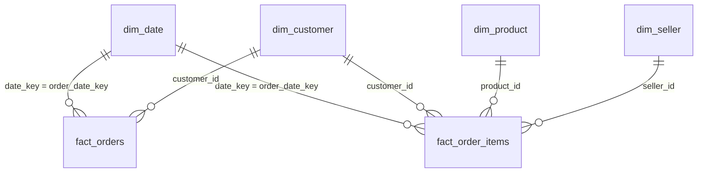

# Power BI data model (star schema)

Load the 6 CSVs in `powerbi/data/` (subset run) or `data/clean_full/star/` (full run, `python run_pipeline.py --source full`).

| From (many) | To (one) | Cardinality | Cross-filter | Active |
|---|---|---|---|---|
| `fact_orders[order_date_key]` | `dim_date[date_key]` | *:1 | Single | yes |
| `fact_order_items[order_date_key]` | `dim_date[date_key]` | *:1 | Single | yes |
| `fact_orders[customer_id]` | `dim_customer[customer_id]` | *:1 | Single | yes |
| `fact_order_items[customer_id]` | `dim_customer[customer_id]` | *:1 | Single | yes |
| `fact_order_items[product_id]` | `dim_product[product_id]` | *:1 | Single | yes |
| `fact_order_items[seller_id]` | `dim_seller[seller_id]` | *:1 | Single | yes |

Do **not** relate the two fact tables to each other (that would make `dim_*` filters ambiguous). Order-level
measures use `fact_orders`; category/seller measures use `fact_order_items`.

## Tables and grain
| Table | Grain | Key columns | Notes |
|---|---|---|---|
| `fact_orders` | 1 row per order | `order_id` | order_value = items + freight; payment_value; delivery_days; is_late; review_score; flags |
| `fact_order_items` | 1 row per order line | `order_id` + `order_item_id` | price, freight_value, item_total, outlier flags |
| `dim_date` | 1 row per day (first..last purchase date) | `date_key` (yyyymmdd) | mark as date table on `calendar_date` |
| `dim_customer` | 1 row per `customer_id` (Olist issues one per order) | `customer_id` | `customer_unique_id` = the person; region; `cohort_month` |
| `dim_product` | 1 row per product | `product_id` | `category_en` (English, 'unknown' if missing) |
| `dim_seller` | 1 row per seller | `seller_id` | state, region |

## Data types to set in Power Query
* `*_key` -> Whole number; `calendar_date`, `month_start`, `cohort_month` -> Date; `purchase_ts` -> Date/Time
* money columns (`price`, `freight_value`, `item_total`, `order_value`, `items_value`, `payment_value`) -> Fixed decimal
* `customer_zip_prefix`, `seller_zip_prefix` -> **Text** (keeps leading zeros)
* flags (`is_*`, `dq_*`, `has_comment`) -> Whole number
* Use `dim_date[month_start]` (Date, format `yyyy-MM`) as the month axis.
